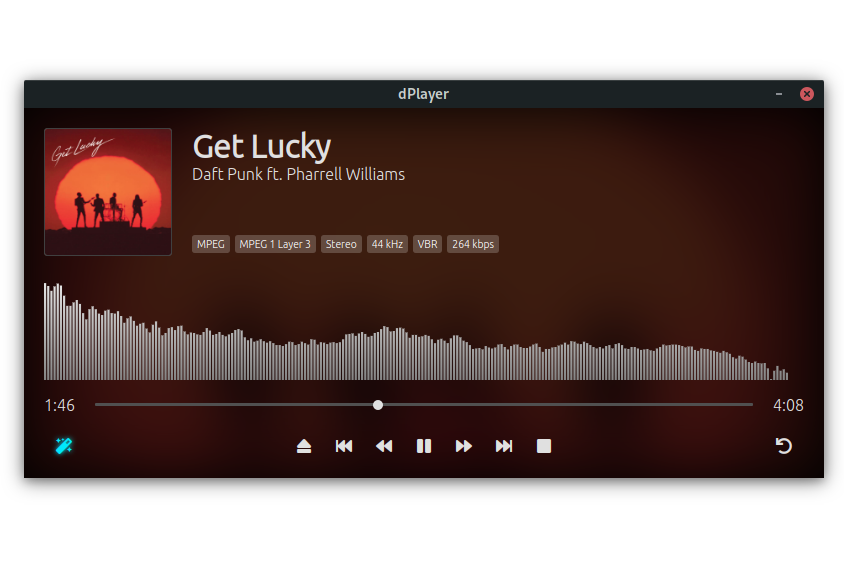

# dPlayer
Advanced audio player based on HTML, CSS, Javascript and Electron.
**dPlayer** uses [dAudio](https://www.github.com/didava/daudio) as main engine for audio playback and plays everything LOUD by **Smart Remaster** feature provided in [dAudio](https://www.github.com/didava/daudio)



## Project setup
```
npm install
```

### Compiles and hot-reloads for development
```
npm run serve
```
